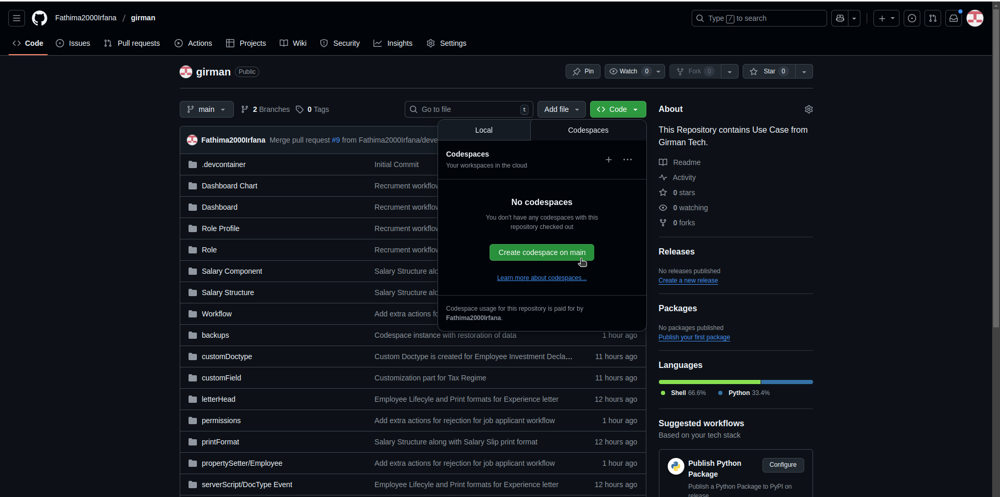

# ERPNext + Frappe HR

This repo provides you an codespace instance for working with Frappe HR.

---

## 🚀 Custom Docker Image

This repository provides a ready-to-use **ERPNext with Frappe HR** environment, based on my **custom Docker image**.
👉 [ferp/ferp-hr](https://github.com/users/fathimairfanas/packages/container/package/ferp%2Fferp-hr)

This image contains:
- Frappe v15
- ERPNext v15
- Frappe HR v15
- Payments v15

---

## 🛠️ How to Spin Up a Demo Instance (Codespaces)

Follow these steps to run ERPNext + Frappe HR in a GitHub Codespace:

1. **Open Codespace**
   - Open a Codespace for this repository (use the **main** branch).
   

2. **Wait for Setup**
   - Wait a few minutes for Docker images to be pulled and containers to start.
   - The ERPNext site will also be automatically created (takes some time).

3. **Access ERPNext**
   - Go to the **Ports tab** in Codespaces.
   - Locate the exposed port and click the **Browse** icon.
   
   - Verify that the **Frappe login page** is visible.

4. **Run Setup Script**
   - In the Codespace terminal, run:
     ```bash
     ./setup.sh
     ```

5. **Login**
   - Refresh the browser — now you are ready to assess my assignment
   

---

## 🔑 Demo Credentials

| Role            | Username        | Password     |
|-----------------|----------------|--------------|
| Administrator   | administrator  | admin        |
| HR Manager      | hr@gmail.com   | hruser@123   |
| Hiring Manager  | hm@gmail.com   | hmuser@123   |
| Interviewer     | in@gmail.com   | inuser@123   |

---

## ✨ Features Implemented

- ✅ **Recruitment Workflow**:  
  Job Opening → Application → Screening → Interview → Offer → Hired  

- ✅ **Role-based permissions** for:
  - HR Manager  
  - Hiring Manager  
  - Interviewer  

- ✅ **Employee Lifecycle Automation**:
  - Joining → Probation → Confirmation → Exit  
  - Auto-updates employee status & generates experience letter  

- ✅ **Salary Structure & Payroll**:
  - Salary Components: Basic, HRA, Special Allowance, PF, Professional Tax  
  - Salary Structure with Earnings and Deductions
  - Payroll Entry for multiple employees  
  - Custom payroll slip print format with branding  

- ✅ **Tax Regimes**:  
  - Tax regime preference available in Employee doctype

- ✅ **Customizations**:
  - Employee Investment Declaration Doctype is available

---

